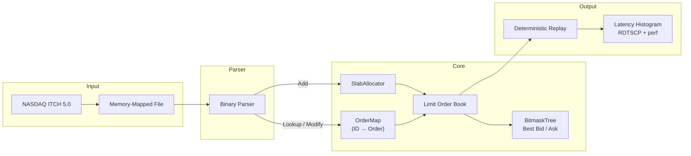
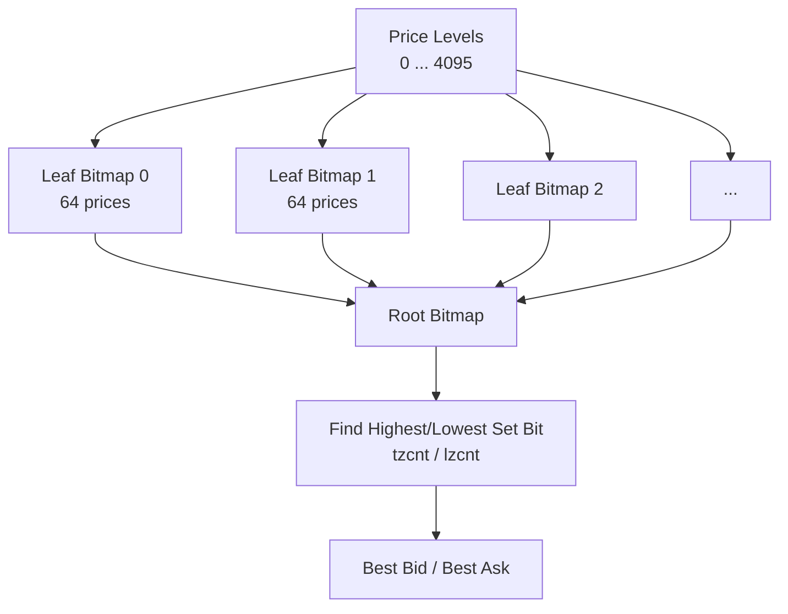

# ⚡ Deterministic Sub-Microsecond NASDAQ ITCH 5.0 Limit Order Book Replay Engine

An ultra-low-latency, zero-allocation C++20 trading engine engineered to replay NASDAQ ITCH 5.0 market data at **7.14 million messages per second** with **nanosecond-scale tail latency** (**138 ns median Add**, **53 ns median Cancel**, **<620 ns p99.9**).

---

## 🏛️ System Architecture

The engine processes binary ITCH messages through an optimized data pipeline designed to keep hot-path working sets resident in L1/L2 CPU caches while eliminating kernel preemption, OS page faults, and dynamic memory allocation.




## 🧠 Key Architectural Decisions & Implementation
1. Message Parser
2. slab allocator
3. custom Flat Hash Table
4. Bitmask Tree (64-ary Tree)
5. Limit Order Book O(1) operations
---
### 1. Slab Alloctor:
- Allocating with std::vector::push_back or new Order gives creates bottlenecks like Global heap contention & syscalls, memory fragmentation, TLB Thrashing
- The Limit Order Book should avoid hot path allocations using new and delete, this leads to jitter and unstable throughput.
- Slab allocator minimizes allocations on hot path and provides a contiguous memory to place all the orders, which in turn improves the cache locality.

Implementation:
- Slab Alloctor uses intrusive linked lists i.e there is no pointer chasing we use indices to get the appropriate orders.
- Forward allocation Optimization: we fill the empty spots from 0 to N i.e forward allocation, this is safer because CPUs have hardware stream prefetcher which are generally good at forward fetching the data.
- Transparent Huge Pages (Number of pages: total_size / size_of_one_page)-> 1. 4KB default had more High TLB miss rate , 2. 2MB pages reduces the TLB Thrashing.
---

### 2. Flat Hash Table: 
- Why not just use std::unordered_map?
- unordered_map uses separate chaining i.e each bucket contains dynamically allocated linked list.
- dynamic allocation + pointer chasing for Linked list makes it worse for cache locality and zero allocation.
- it also requires modulo which uses around 15-25 cpu cycles in general.

Implementation:
- Flat Hash Table uses a struct with 16 byte allocation using alignas(16) it contains key and value, the key is order_reference_number and the value is the order_index (used for slab allocator)
- we specifically assign the size of table to be a power of 2 (in our case 1U << 24) this allows us to use bitmasking instead of modulo operations
- bitmask = size -1; eg: size = 8 => bits = 1000 | bitmask = 7 => bits = 0111 | we get the same result as modulo without the modulo operation and within 1 cpu cycle.
- We use Linear Probing with tombstones, with average probing of 1, i.e on the first try we were able to place the order in the flat hash table.
- The hash we used is a simplified version of Murmurhash where instead of 3 xor + bitshift + mutliplication math, we just did 2 xor + bitshift and 1 Multiplication.
---
### 3. Bitmask Tree (64-ary Tree):
- since we used flat hash tables insted of maps, we cannot use the sorting property of map, we still need O(1) way to get the best ask and the best bid.

Implementation:
- Bitmask Tree is a 64-ary Tree, in our case it has 5 levels, from level 0 to level 4, it can store max_price upto 1U << 21.
- we store values in the form of 64_bit intergers using uint64_t
- eg: lets say we only want to store values with 3 bits
level 0                                     Root: 010
level 1             node: 000               node: 001                       node: 000
level 2 3leaf nodes with bits: 000   node: 000   node: 000   node:010       3leaf nodes with bits: 000



for the actual math please check: include/BitmaskTree.hpp


## 📊 Performance & Benchmarks

The engine was benchmarked replaying a complete production NASDAQ ITCH 5.0 market day (423,285,709 messages). 
Core loops were timed using serialized `rdtsc hardware cycle counters` under real-time FIFO kernel priority `(chrt -f 99)` on pre-faulted memory pages `(MAP_POPULATE)`.

### Latency Scorecard (Intel Core i3-540 @ 3.07 GHz / DDR3-1333)

| Message Type            |       Count | Avg (ns) | Min (ns) | p50 Median (ns) | p90 (ns) | p99 (ns) | p99.9 (ns) |  Max (ns) |
| ----------------------- | ----------: | -------: | -------: | --------------: | -------: | -------: | ---------: | --------: |
| **Add Order ('A'/'F')** | 186,610,705 |    153.1 |       18 |             138 |      198 |      298 |        410 | 7,599,842 |
| **Execute ('E'/'C')**   |   8,415,610 |    167.5 |       18 |             149 |      302 |      452 |        619 |   670,108 |
| **Cancel ('X')**        |   4,990,972 |     96.0 |       15 |              53 |      242 |      358 |        474 |   155,614 |
| **Delete ('D')**        | 180,285,101 |    170.0 |       22 |             151 |      326 |      461 |        618 | 3,354,815 |
| **Replace ('U')**       |  36,777,372 |    288.6 |       32 |             266 |      427 |      596 |      1,334 | 2,462,268 |

Throughput: `423,285,709 messages` processed in `59.2 seconds` of user execution time `(~7.14M messages/second on 2010 Westmere silicon)`.

### Hardware Profiling (perf stat Microarchitectural Breakdown)
```text
208,108,286,829      cycles
 80,559,402,091      instructions              # 0.39 IPC (memory-latency dominated)
 23,010,619,937      cache references
 10,636,156,631      cache misses              # 46.22% of cache references
 11,987,887,581      branches
    865,425,492      branch misses             # 7.22% branch misprediction rate
  2,471,384,072      L1 data cache load misses
    814,843,558      Last-Level Cache (LLC) load misses
    431,034,742      dTLB load misses          # 3.60% dTLB miss rate with 2 MB huge pages
```


## 🛠️ Build & Run Instructions
#### Prerequisites
```text
    Linux kernel with Transparent Huge Pages (THP) enabled

    GCC 11+ or Clang 13+ with -std=c++20 support
```

#### Compilation
```bash
g++ -O3 -march=native -mtune=native -flto -DNDEBUG -std=c++20 -pthread -o itch_engine main.cpp
```

