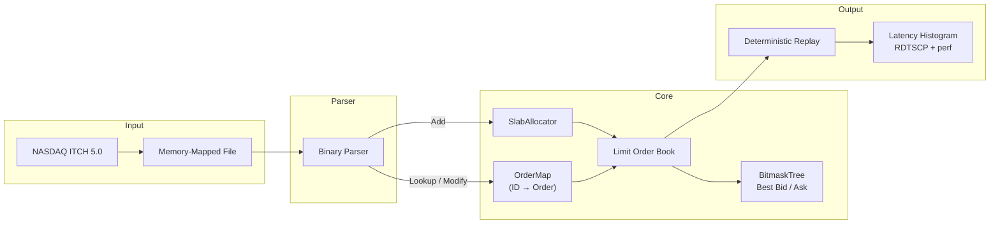
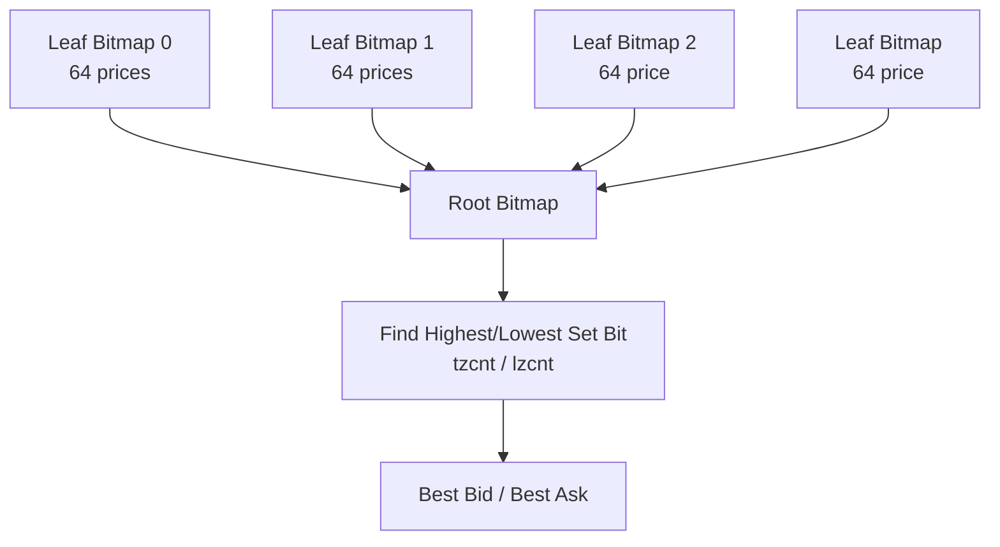

# ⚡ Deterministic NASDAQ ITCH 5.0 Limit Order Book Replay Engine

An ultra-low-latency, zero-allocation C++20 trading engine engineered to replay NASDAQ ITCH 5.0 market data at **5.51 million messages per second** with **nanosecond-scale tail latency** (**141 ns median Add**, **113 ns median Cancel**, **<1.5us p99**).

---

## 📊 Performance & Benchmarks

* **Throughput:** 5.51 Million msgs/sec pure CPU throughput (423M total messages).
* **Deterministic Execution:** Achieved deterministic low latency via $O(1)$ lazy deletion tombstones and strict CPU thread-pinning to ensure zero context switches.


### Latency Scorecard (Intel Core i3-540 @ 3.07 GHz / DDR3-1333)

### Latency Histogram (Nanoseconds)
| Message Type            | Count       | p50 (Median) | p90   | p99      | Max      |
| :---------------------- | :---------- | :---------  | :----- | :------- | :------- |
| **Add Order ('A'/'F')** | 186,610,705 | **141 ns**  | 483 ns | 1,048 ns | ~13.3 ms |
| **Cancel ('X')**        | 4,990,972   | **113 ns**  | 329 ns | 716 ns   | ~5.4 ms  |
| **Execute ('E'/'C')**   | 8,555,084   | **173 ns**  | 677 ns | 1,168 ns | ~6.6 ms  |
| **Delete ('D')**        | 180,285,101 | **223 ns**  | 635 ns | 1,175 ns | ~6.7 ms  |
| **Replace ('U')**       | 36,777,372  | **389 ns**  | 891 ns | 1,411 ns | ~4.4 ms  |

### Hardware & OS Telemetry (`perf stat`)
To validate the mechanical sympathy of the engine, execution was profiled using hardware performance counters. The results below confirm absolute zero OS scheduler interference and efficient memory access patterns due to 2MB Explicit Huge Pages and memory pooling.

*(Note: Latency histograms were captured in a separate instrumented build. The telemetry below reflects the pure throughput build with `RDTSCP` pipeline-stalls removed).*

```text
 Performance counter stats for './itch_engine':

   307,581,746,188      cycles                                                                  (49.99%)
    95,991,879,308      instructions                                                            (62.51%)
     2,239,066,292      LLC-loads                                                               (62.49%)
     1,534,331,894      LLC-load-misses                                                         (62.48%)
     2,810,511,476      cache-references                                                        (62.48%)
     1,831,807,487      cache-misses                                                            (62.53%)
    21,214,308,910      dtlb-load                                                               (49.99%)
       986,133,397      dtlb-load-misses                                                        (50.03%)

     258.387173703 seconds time elapsed

      91.152077000 seconds user
      10.979294000 seconds sys
```


---

## 🏛️ System Architecture

The engine processes binary ITCH messages through an optimized data pipeline designed to keep hot-path working sets resident in L1/L2 CPU caches while eliminating kernel preemption, OS page faults, and dynamic memory allocation.


```mermaid
flowchart LR

    subgraph Input
        FILE["NASDAQ ITCH 5.0"]
        MMAP["Memory-Mapped File"]
    end

    subgraph Parser
        PARSER["Binary Parser"]
    end

    subgraph Core
        MAP["OrderMap<br/>(ID → Order)"]
        SLAB["SlabAllocator"]
        LOB["Limit Order Book"]
        BITTREE["BitmaskTree<br/>Best Bid / Ask"]
    end

    subgraph Output
        REPLAY["Deterministic Replay"]
        STATS["Latency Histogram<br/>RDTSCP + perf"]
    end

    FILE --> MMAP
    MMAP --> PARSER

    PARSER -->|"Add"| SLAB
    PARSER -->|"Lookup / Modify"| MAP

    SLAB --> LOB
    MAP --> LOB

    LOB --> BITTREE

    LOB --> REPLAY
    REPLAY --> STATS
```


## 🧠 Key Architectural Decisions & Implementation
1. Message Parser
2. slab allocator
3. custom Flat Hash Table
4. Bitmask Tree (64-ary Tree)
5. Limit Order Book O(1) operations
---
## Architectural Components

### 1. Slab Allocator (`Order` Management)
* **Purpose:** Manages the lifecycle of high-frequency `Order` mutations across 423 million ITCH messages without triggering standard heap allocations (`malloc`/`new`).
* **Mechanical Design:** Pre-allocates memory blocks aligned to exact 2 MB boundaries and backs them with  Huge Pages (`MAP_HUGETLB`) to minimize Translation Lookaside Buffer (TLB) misses.
* **Intrusive Free-List:** Bypasses external bookkeeping structures by embedding free-list pointers directly inside dead or unallocated order slots. When an order is created or canceled, recycling happens in absolute $O(1)$ time with zero branching overhead.
* **Initialization Safety:** Initialized as a `std::unique_ptr` inside `main()` to prevent pre-boot termination and ensure deterministic memory layout before the streaming loop starts.


### 2. Flat Hash Map vs. SIMD Map
* **Purpose:** Maps `order_id` to the order index in slab allocator.
* **Flat map vs SIMD map:** Initial experiments utilizing Swiss table SIMD-accelerated vector lookups were benchmarked against a cache-aligned Flat Hash Map using `perf stat`. Hardware counters revealed that the SIMD map incurred **730 Million additional L3 cache misses** due to instruction bloat and vector register thrashing across cache line boundaries (sse4.1 128bit registers).
* **16-Byte Alignment Optimization:** The lookup architecture was pivoted to a **16-byte aligned Flat Hash Map** engineered to fit key-value entries precisely within a single hardware cache line, eliminating secondary memory fetches on symbol resolution.

  
### 3. Paged Price Levels (`ArenaAllocator`)
* **Purpose:** Stores contiguous arrays of price tiers (bids and asks) for every active order book.
* **Arena Allocation Strategy:** Replaces fragmented heap nodes with a **Page Allocator** backed by `mmap & MAP_HUGETLB`. 
### 4. Paged Bitmask Tree (Best Bid / Offer Engine)
* **Purpose:** Tracks order book price states to query the Best Bid and Best Offer (BBO) in constant time.
* **Hierarchical Bitwise Architecture:** Replaces traditional pointer-heavy binary trees or sorted vectors with a flat, multi-level bitmask structure ($4,096$ words at the bottom level, $64$ words at the middle level, and a single root word).
* **Hardware-Accelerated Traversal:** Utilizes modern CPU intrinsic instructions like `__builtin_ctzll` (Count Trailing Zeros) to find the highest/lowest active price bit in a single CPU cycle. This guarantees $O(1)$ BBO updates and lookups regardless of market volatility or book depth.


```mermaid
flowchart TD


    B1["Leaf Bitmap 0<br/>64 prices"]
    B2["Leaf Bitmap 1<br/>64 prices"]
    B3["Leaf Bitmap 2<br/>64 price"]
    B4["Leaf Bitmap <br/>64 price"]


    C["Root Bitmap"]

    B1 --> C
    B2 --> C
    B3 --> C
    B4 --> C

    D["Find Highest/Lowest Set Bit<br/>tzcnt / lzcnt"]

    C --> D

    E["Best Bid / Best Ask"]

    D --> E
```

for the actual math please check: include/BitmaskTree.hpp


## 🛠️ Build & Run Instructions
#### Prerequisites
```text
    Linux kernel with Transparent Huge Pages (THP) enabled

    GCC 11+ or Clang 13+ with -std=c++20 support
```

#### Compilation
```bash
g++ -O3 -march=native -mtune=native -flto -DNDEBUG -std=c++20 -pthread -o itch_engine main.cpp
```

